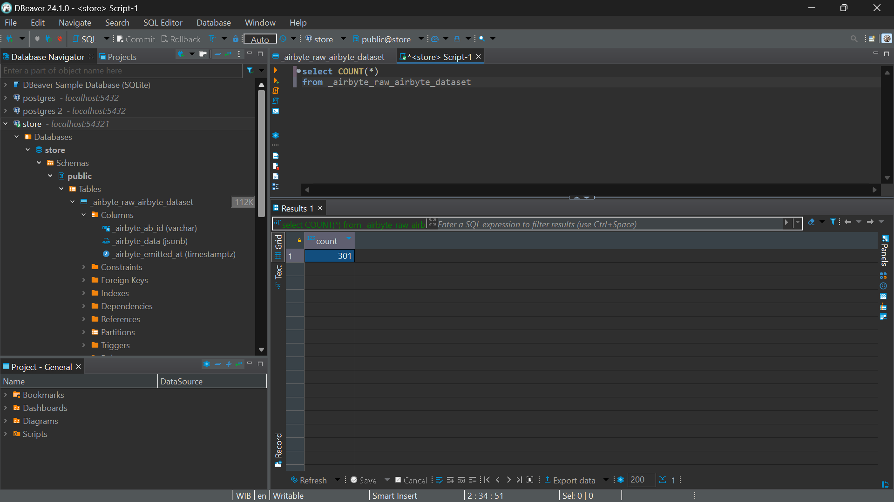

### TASK 3

#### 1). Screenshot jika sudah berhasil connect ke source local file / url file task-day3.json

#### 2). Screenshot jika sudah berhasil connect ke destination postgres db

#### 3). Screenshot Jika sudah berhasil berhasil membuat connection dari local file / url file task-day3.json ke postgres.
Clue: Pilih Raw data

#### 4). Screenshot untuk tampilkan data yg sudah berhasil di ingest ke postgres.
Clue: Hanya 1 table saja yang ter-create di postgres

